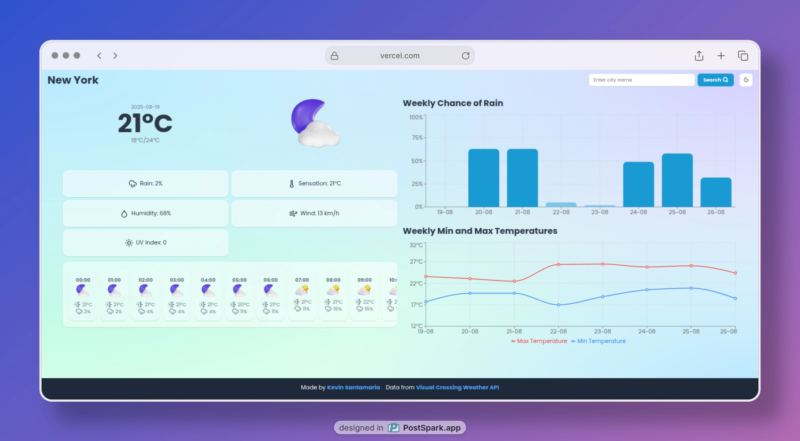

# Weather React TS App

This is a weather application built with **React**, **Vite**, and **TypeScript**, designed to provide accurate and visually appealing weather information. The app is powered by the <a href="https://www.visualcrossing.com/weather-api/" >Visual Crossing Weather API</a> and includes modern UI/UX features.

## Features

- **General Weather Information.**
- **Next 24 Hours Forecast.**
- **7-Day Precipitation Bar Chart.**
- **7-Day Max/Min Temperatures Line Chart.**
- **Responsive Design.**
- **Dark/Light Mode Support.**
- **Celsius-Only Display.**

## Tech Stack

- **React** and **Vite**: Fast and modern development environment.
- **TypeScript**: Strongly typed programming language for better code quality.
- **Bun**: Lightning-fast JavaScript runtime and package manager.
- **TailwindCSS**: Utility-first CSS framework for responsive and customizable styling.
- **shadcn/ui**: Pre-designed UI components for a cohesive design system.
- **Recharts**: Library for creating interactive and customizable charts.
- **TanStack Query**: Powerful tool for data fetching and caching.
- **Axios**: Promise-based HTTP client for seamless API communication.
- **Zustand**: Simple and scalable state management solution.
- **Day.js**: Lightweight library for date and time manipulation.

## Installation

1. Clone the repository:
  ```bash
  git clone https://github.com/your-username/weather-react-ts-app.git
  cd weather-react-ts-app
  ```

2. Install dependencies using Bun:
  ```bash
  bun install
  ```

3. Create a `.env` file in the root directory and add your **Visual Crossing Weather API** key:
  ```env
  VITE_WEATHER_API_KEY=your_api_key_here
  ```

4. Start the development server:
  ```bash
  bun dev
  ```

## Usage

- Open the app in your browser at `http://localhost:3000`.
- Search for a location to view its weather information.
- Toggle between dark and light modes using the theme switcher.

## Screenshots



## Live Demo

- <a href="https://kevsantamaria.github.io/weather-dashboard/">kevsantamaria.github.io/weather-dashboard/</a>